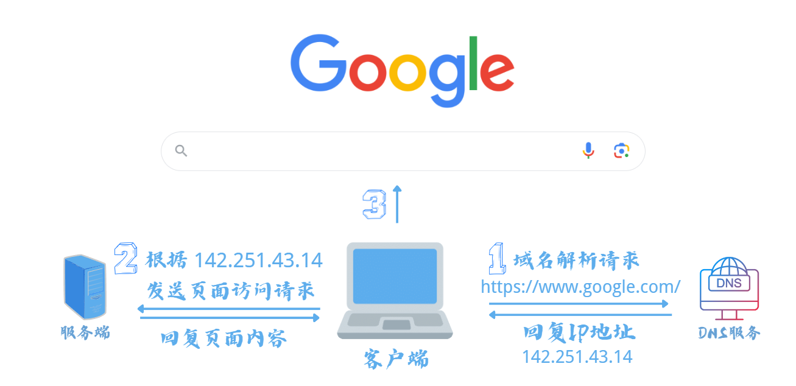

# 浏览网页背后的技术与原理

# 前言

在我们日常浏览网页的过程中，常常会打开浏览器，输入网页地址，然后按下回车键，随即就能呈现出所需内容。然而，在这看似简单的用户行为背后，实际上涵盖着怎样的一系列复杂过程呢？

# Web 工作方式

针对一般的上网流程，系统的执行步骤如下所述：

1. 浏览器作为客户端，当您输入一个`URL`地址时，首要动作是向`DNS`服务器发出请求。`DNS`服务器会返回对应域名的`IP`地址。
2. 接着，浏览器会使用所获取的`IP`地址，找到对应的服务器，并要求建立TCP连接。在连接建立成功后，浏览器会发送`HTTP`请求包。服务器接收到请求包后，开始处理请求。服务器会调用自身的服务来生成`HTTP`响应包，然后将其发送回来。
3. 客户端（浏览器）收到来自服务器的响应后，开始渲染响应包中的主体内容。当渲染完成并成功呈现内容后，客户端会断开与服务器之间的`TCP`连接。



<br />

一个`Web`服务器，也被称作`HTTP`服务器，通过`HTTP`协议与客户端进行通信。在此情境中，客户端主要指的是`Web`浏览器（实际上，移动设备上的应用内浏览器也是浏览器的实现）。

Web服务器的运作原理可以简洁地总结如下：

1. 客户端通过`TCP/IP`协议建立与服务器的`TCP`连接。
2. 客户端向服务器发送`HTTP`请求，以获取所需的资源文档。
3. 服务器向客户端发送`HTTP`响应，若请求的资源包含有动态内容，服务器将会调用动态语言解释引擎来处理动态内容，并将处理结果发送回客户端。
4. 客户端与服务器断开连接。客户端会解析`HTML`文档，并在客户端屏幕上呈现出图形化的结果。

这种简易的`HTTP`交互过程，虽然看起来似乎复杂，实际上背后的原理相当直观。不过需要注意的是，客户端与服务器之间的通信并不是持久连接，也就是说，当服务器发送完响应后，会立即断开与客户端的连接，然后等待下一次请求的到来。

# URL

`URL` (Uniform Resource Locator) 是一种网络上的标识符，即“统一资源定位符”。它用于定位并描述一个特定的资源，可以是网页、图片、视频或其他类型的文件。URL提供了一种标准化的方式来描述资源的位置以及如何访问这些资源。通过`URL`，我们能够在互联网上准确地指定资源的位置以及如何获取它。它由多个部分组成，每个部分都提供了关于资源的特定信息。以下是URL的主要组成部分：

1. **协议（Protocol）**: 协议是URL的开头部分，指定了访问资源的方式。常见的协议包括：
   - **http**：用于访问普通的网页资源，通常是网页浏览器使用的默认协议。
   - **https**：与HTTP类似，但使用了加密的安全连接，用于保护敏感信息的传输。
   - **ftp**：用于文件传输协议，通常用于上传和下载文件。
   - **file**：用于访问本地计算机上的文件。
2. **域名（Domain Name）**: 域名是资源所在服务器的名称。它通常由两个主要部分组成，例如：`www.example.com`。其中，`“www”`是子域名，它可以是一个特定的服务器，而`“example.com”`是顶级域名，表示网站的整体。
3. **端口号（Port Number）**: 端口号是用于在服务器上标识特定服务的数字。例如，`HTTP`通常使用端口号80`，而`HTTPS`使用端口号`443`。如果没有显式指定端口号，通常会使用默认的端口号。
4. **路径（Path）**: 路径指定了服务器上资源的具体位置。它是`URL`中域名后面的部分，用斜杠分隔。例如对于 `"http://www.example.com/blog/post1"`，`"/blog/post1"`就是路径。
5. **查询参数（Query Parameters）**: 查询参数允许你在`URL`中传递额外的信息给服务器。它们以问号（`?`）开始，多个参数之间用`“&”`符号分隔。例如，在`"http://www.example.com/search?q=keyword&page=1"` 中，查询参数是 `"q=keyword&page=1"`。
6. **片段标识（Fragment Identifier）**: 片段标识是`URL`中的另一个可选部分，用于标识资源中的特定部分。它以井号（`#`）开始，后面跟着标识符。通常在网页内部导航时使用。

综合起来，一个完整的URL如下所示：

```shell
协议://域名:端口号/路径?查询参数#片段标识
```

例如，下面是一个完整的URL示例：

```shell
https://www.example.com:443/blog/post1?q=keyword&page=1#section2
```

这个`URL`使用`HTTPS`协议访问名为`"www.example.com"`的服务器，端口号是`443`，路径是`"/blog/post1"`，查询参数是`"q=keyword&page=1"`，片段标识是`"section2"`。通过解析`URL`，你可以定位并访问互联网上的各种资源。

# DNS

DNS（Domain Name System，即域名系统）是互联网上的一种服务，它负责将人类可读的域名（如www.qq.com）转换为计算机能够理解的IP地址（如192.168.1.1），从而实现网络资源的定位和访问。

> `DNS` 是一种组织成域层次结构的计算机和网络服务命名系统，它用于 TCP/IP 网络，从事将主机名或域名转换为实际 IP 地址的工作。
>
> 通过将域名映射到相应的 IP 地址，DNS 允许网络设备相互通信，无论是发送电子邮件、浏览网页还是进行其他在线活动。DNS 通过分层的结构来管理域名和 IP 地址之间的映射关系，这种分层结构有助于快速查找和更新域名解析信息。

`DNS`的工作过程如下：

1. **本地`Hosts`文件检查：** 当在浏览器中输入一个域名，操作系统会首先检查本地`Hosts`文件，该文件包含了域名与`IP`地址的映射关系。如果找到了匹配项，解析过程就会终止，直接使用`Hosts`文件中的`IP`地址进行访问。
2. **本地`DNS`缓存查找：** 如果`Hosts`文件中没有找到对应的映射关系，操作系统会查询本地`DNS`缓存。如果之前已经进行过域名解析，并且结果被缓存，系统会直接使用缓存的`IP`地址进行访问。
3. **本地`DNS`服务器查询：** 如果本地缓存中没有相应的条目，操作系统会将域名解析请求发送到本地`DNS`服务器，通常由`ISP`提供。本地`DNS`服务器可能会有两种情况：
   - **已缓存解析：** 如果本地`DNS`服务器之前已经进行过相同域名的解析并缓存了结果，它会直接返回缓存的`IP`地址。
   - **迭代查询或递归查询：** 如果本地`DNS`服务器未缓存结果，它会根据查询的域名层级从根域名服务器开始逐级查询，直至找到负责该域名的权威域名服务器。
4. **根域名服务器查询：** 如果本地`DNS`服务器没有相关缓存条目，它会向根域名服务器发送查询请求。根域名服务器不负责具体域名解析，而是返回负责顶级域（如`.com`、`.org`等）的顶级域名服务器的`IP`地址。
5. **顶级域名服务器查询：** 本地`DNS`服务器接收到顶级域名服务器的`IP`地址后，会向其发送查询请求。顶级域名服务器会返回负责下一级域的权威域名服务器的`IP`地址。
6. **权威域名服务器查询：** 本地`DNS`服务器继续向权威域名服务器发送查询请求，直至达到负责域名的权威域名服务器。这台服务器将返回所请求域名的`IP`地址。
7. **解析结果返回：** 解析结果从权威域名服务器返回给本地`DNS`服务器，然后通过本地`DNS`服务器返回给操作系统和应用程序，最终实现域名解析。

可以看到，`DNS`通过一系列层次化的查询和缓存机制，将人类可读的域名映射为计算机可识别的`IP`地址，以实现互联网资源的定位和访问。这个过程使得互联网的使用变得更加便利和用户友好。

> 在浏览器发起请求访问特定的网站时，经过 `DNS` 解析后，最终获取的是该网站的 `IP` 地址。浏览器使用获取到的 `IP` 地址，建立与目标服务器的连接。一旦连接建立，浏览器与服务器之间就可以进行数据交换，包括请求网页内容和接收服务器响应。浏览器接收服务器的响应数据，根据接收到的信息渲染网页内容并显示给用户。

# HTTP 协议

> HTTP 协议是 Web 工作的核心，要了解清楚 Web 的工作方式就需要详细的了解清楚 HTTP 是怎么样工作的。

`HTTP`（Hyper Text Transfer Protocol，超文本传输协议）是一种用于在网络上传输超文本数据的协议。它是万维网（World Wide Web）中的基础通信协议，用于在Web服务器和客户端（通常是浏览器）之间传递数据，包括文本、图片、视频、音频等。`HTTP`使用在`TCP/IP`协议栈的应用层，通过`TCP`连接在`Web`应用之间进行数据传输。

> HTTP 是一种基于请求-响应模型的协议。客户端发送一个称为 "请求" 的信息给服务器，然后服务器会处理该请求并发送一个称为 "响应" 的信息回到客户端。请求和响应都由头部（headers）和正文（body）组成。

## HTTP 请求（Request）

当客户端需要从服务器获取资源或执行某种操作时，它会发送一个HTTP请求（Request）。

Request 包分为 3 部分，第一部分叫 Request line（请求行）, 第二部分叫 Request header（请求头）, 第三部分是 body（主体）。**header 和 body 之间有个空行**，也就是分割请求头和消息体。

### 请求行（Request Line）

请求行是HTTP请求的起始部分，包含三个主要信息：

1. **请求方法（Request Method）**：定义了客户端希望服务器执行的操作。常见的请求方法包括：
   - `GET`：用于获取指定资源的数据。
   - `POST`：用于向服务器提交数据，通常用于表单提交或上传文件。
   - `PUT`：用于将数据存储到服务器上的指定位置。
   - `DELETE`：用于删除服务器上的指定资源。
   - `HEAD`：类似于GET，但只返回头部信息，不返回实际数据。
   - `OPTIONS`：用于获取有关服务器支持的请求方法和功能的信息。
   - ...
2. **目标URL（Uniform Resource Locator）**：表示客户端希望访问的资源的地址。它包括协议（如http或https）、域名或IP地址以及资源的路径。
3. **协议版本（HTTP Version）**：指定所使用的`HTTP`协议版本，例如`HTTP/1.1`或`HTTP/2`。

### 请求头（Request Headers）

请求头包含了关于请求的附加信息，帮助服务器处理请求的方式。一些常见的请求头字段包括：

- **User-Agent**：标识发起请求的用户代理（通常是浏览器），有助于服务器适应不同的客户端。
- **Host**：指定服务器的域名或`IP`地址和端口号。
- **Accept**：指定客户端能够处理的媒体类型（例如文本、图片、视频等）。
- **Authorization**：在需要身份验证的情况下，提供身份验证凭据。
- **Content-Type**：用于`POST`或`PUT`请求，指定请求体中的数据类型，例如`application/json`或`application/x-www-form-urlencoded`。
- **Cookie**：包含之前由服务器设置的`cookie`信息，用于维护状态。

### 请求体（Request Body，可选）

请求体仅在某些请求方法（如`POST`或`PUT`）中出现，用于携带客户端希望传输给服务器的数据，即请求资源参数。请求体的格式取决于`Content-Type`头部字段的值，可以是表单数据、`JSON`、`XML`等。

## HTTP 响应（Response ）

当服务器接收到客户端的HTTP请求并处理后，它会返回一个HTTP响应。

### 状态行（Status Line）

状态行是HTTP响应的起始部分，包含三个主要信息：

- **协议版本（Protocol Version）**：指定服务器使用的HTTP协议版本，如HTTP/1.1。
- **状态码（Status Code）**：表示服务器对请求的处理结果的数字代码。状态码提供了关于请求是否成功以及失败原因的信息。常见的状态码包括：
  - `200` OK：请求成功，服务器成功处理了请求。
  - `404` Not Found：请求的资源未找到。
  - `500` Internal Server Error：服务器内部错误，无法完成请求。
  - `302` Found：临时重定向，请求的资源已经被临时移动。
  - `401` Unauthorized：未授权，需要进行身份验证。
- **状态短语（Status Phrase）**：与状态码相对应的短文本描述，提供了对状态码的更详细说明。

### 响应头（Response Headers）

响应头包含了关于响应的附加信息，帮助客户端理解服务器返回的内容。一些常见的响应头字段包括：

- **Server**：指定服务器的类型和版本。
- **Date**：指定响应生成的日期和时间。
- **Content-Type**：指定响应体中数据的类型，例如`text/html`、`application/json`等。
- **Content-Length**：指定响应体中数据的长度，以字节为单位。
- **Location**：用于重定向响应，指定新的资源位置。
- **Cache-Control**：指定响应的缓存控制策略。

### 响应体（Response Body，可选）

响应体是服务器返回给客户端的实际数据。它可以包含各种类型的数据，如`HTML`内容、图片、文件等，具体内容取决于服务器的处理和请求的性质。

## HTTP 请求方法

`HTTP`协议定义了多种请求方法，其中最基本和常见的是`GET`、`POST`、`PUT`和`DELETE`。这些方法对应着在网络上的资源上执行不同的操作，如查、增、改、删。

1. **GET**：`GET`方法用于从服务器获取资源的信息。当客户端发送`GET`请求时，服务器会将请求的资源返回给客户端。`GET`请求通常用于获取资源的操作，例如浏览网页、获取数据等。由于GET请求不应该有副作用，即不应该改变服务器状态，所以它适合用于幂等操作（多次请求返回的结果相同）。
2. **POST**：`POST`方法用于向服务器提交数据，从而对资源进行更新或创建。客户端发送`POST`请求时，通常会附带请求体，包含需要传递给服务器的数据。
3. **PUT**：`PUT`方法用于将客户端提供的数据存储在服务器上的指定位置。通常用于更新资源，客户端需要提供完整的资源数据，因为`PUT`会完全替换服务器上的数据。
4. **DELETE**：`DELETE`方法用于从服务器上删除指定的资源。发送`DELETE`请求会请求服务器删除指定资源，服务器执行后资源将被删除。

> 事实上，最常见的就是 `GET` 和 `POST` 了。`GET` 一般用于获取 / 查询资源信息，而 `POST` 一般用于更新资源信息。

## 状态码：

HTTP 响应中的状态码用于表示服务器对请求的处理结果，常见的状态码包括：

状态行是 HTTP 响应中的第一行，它由 HTTP 协议版本号、状态码和状态消息三部分组成。其中，**状态码**用来向 HTTP 客户端传达服务器对请求的处理结果，它们帮助客户端了解服务器是否成功处理请求。

HTTP/1.1 协议中定义了五个类别的状态码，每个类别有一系列具体的状态码：

1. **信息性状态码（1xx）：** 表示服务器已接收请求，但需要进一步处理或等待客户端继续操作。例如：
   - 100 Continue：服务器已经收到请求的一部分，客户端应该继续发送请求的剩余部分。
   - 101 Switching Protocols：服务器要求切换协议，例如从 HTTP 到 WebSocket。
2. **成功状态码（2xx）：** 表示服务器成功地处理了请求。
   - 200 OK：请求成功，服务器返回了请求的内容。
   - 201 Created：请求已经被成功处理，并且服务器创建了新资源。
   - 204 No Content：请求成功，但服务器没有返回内容。
3. **重定向状态码（3xx）：** 表示需要客户端采取进一步的操作来完成请求。
   - 301 Moved Permanently：请求的资源被永久移动到新的 URL。
   - 302 Found：请求的资源被临时移动到新的 URL。
   - 304 Not Modified：客户端缓存的资源仍然有效，服务器返回无需修改的状态。
4. **客户端错误状态码（4xx）：** 表示客户端的请求有误，服务器无法处理。
   - 400 Bad Request：请求语法错误，服务器无法理解。
   - 401 Unauthorized：请求需要用户认证。
   - 404 Not Found：请求的资源不存在。
5. **服务器错误状态码（5xx）：** 表示服务器在处理请求时发生了错误。
   - 500 Internal Server Error：服务器遇到了意料之外的错误。
   - 502 Bad Gateway：服务器作为网关或代理，从上游服务器接收到无效的响应。
   - 503 Service Unavailable：服务器暂时无法处理请求，通常是因为过载或维护。


# 总结

现代网络世界的运作背后，隐藏着许多复杂的技术和协议。了解浏览网页的工作原理，从`URL`解析到`HTTP`通信，可以帮助我们更好地理解互联网的基本运作方式。从浏览器发起请求，经过`DNS`解析，最终获取服务器响应，每个步骤都是一个精密的环节，共同构成了我们每天都在享受的网络体验。