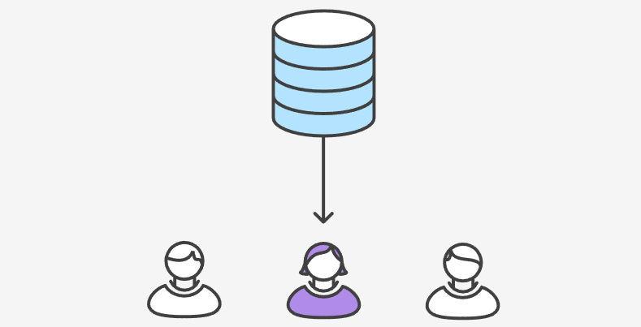
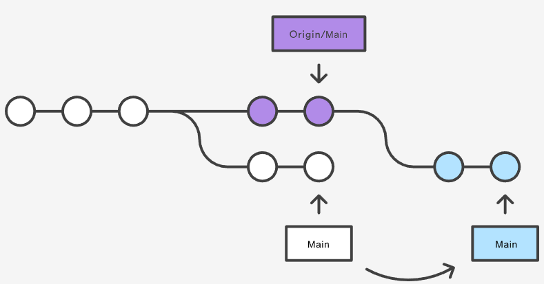
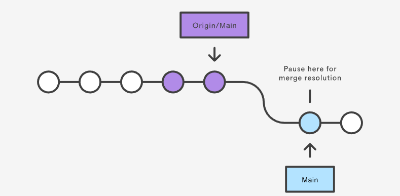
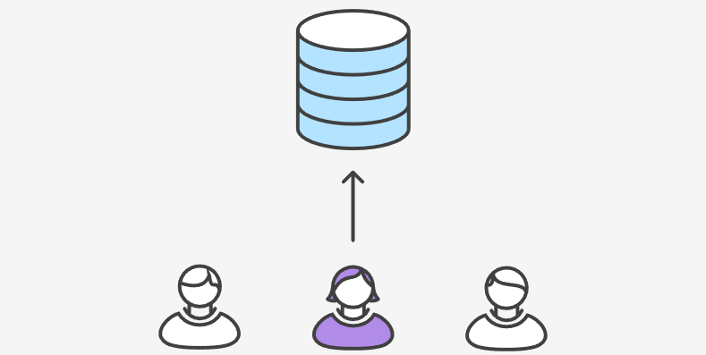

# Centralized Workflow

在Git中，集中式工作流（Centralized Workflow）是一种协作开发的模式，其中有一个主要的中央代码仓库，团队成员将其视为协作的中心点。这种工作流程与分布式工作流（如Gitflow或GitHub Flow）相对，分布式工作流中每个团队成员都有自己的本地代码库副本。

## 工作方式

1. **单一主分支（主干）：** 在集中式工作流中，只存在一个主分支（通常是`master`或`main`分支）。所有的开发工作都在这个主分支上进行。
2. **克隆代码库：** 开发者首先会从中央代码库克隆（或者拉取）最新的代码到本地仓库。
3. **开发工作：** 开发者在本地仓库中进行自己的开发工作，包括添加新特性、修复bug等。
4. **提交更改：** 开发者将他们的更改提交到本地仓库的主分支。
5. **获取更新：** 在提交自己的更改之前，开发者通常会先获取远程主分支的最新更新，确保自己的代码是基于最新代码进行开发的。
6. **解决冲突：** 如果有多个开发者同时修改了同一部分的代码，就可能会产生冲突。在集中式工作流中，冲突通常在本地解决，然后再提交到主分支。
7. **合并到主分支：** 开发者的更改经过测试并且没有冲突后，会将这些更改合并到主分支中。
8. **发布版本：** 当开发达到某个里程碑或版本号时，团队可以选择发布一个新的版本。这通常涉及将主分支的特定状态标记为一个版本，并且可以创建一个标签（tag）来标识这个版本。

## 使用Git的集中式工作流优势

1. **每个开发者拥有本地拷贝：** 每个开发者都可以在自己的本地环境中拥有整个工程的拷贝，这种隔离的环境使得各个开发者的工作与其他部分的修改独立开来。
2. **自由提交到本地仓库：** 开发者可以自由地提交修改到自己的本地仓库，而不需要立即考虑上游的开发。这意味着开发者可以在自己的本地环境中先进行一些实验性的修改，然后在方便的时候再将这些修改反馈到主仓库。
3. **强大的分支和合并模型：** `Git`提供了强大的分支和合并模型，使得创建、管理和合并分支变得更加容易。这是相对于集中式版本控制系统的一个显著优势。

## 冲突解决

在集中式工作流中，中央仓库通常代表了正式项目的状态，而提交历史的稳定性和一致性对于团队的协作和版本管理至关重要。在`Git`中，确保本地的提交历史与中央仓库保持一致的操作是通过分支合并和推送的方式来实现的。

具体来说，如果开发者在本地进行了修改并提交了一些更改，想要将这些更改推送到中央仓库（例如`master`分支），`Git`会执行以下操作：

1. **获取远程更新：** 开发者在推送之前，首先应该获取中央仓库的最新更新。这可以通过执行`git pull origin master`命令来实现，其中`origin`是远程仓库的名称，`master`是主分支的名称。
2. **合并本地修改：** 如果从中央仓库拉取更新后，发现本地提交历史和中央仓库有了分歧，Git会尝试自动合并这些更改。如果合并过程中出现冲突，开发者需要手动解决冲突，并进行提交。
3. **推送到中央仓库：** 一旦本地的提交历史和中央仓库保持一致，开发者可以执行`git push origin master`命令将本地的更改推送到中央仓库的`master`分支。如果推送成功，中央仓库的历史将会更新。
4. **防止覆盖稳定提交：** 如果在推送的过程中，发现本地的提交历史会覆盖中央仓库中的稳定提交，Git会拒绝推送。这是为了确保中央仓库的提交历史保持稳定和一致。


## 示例

让我们一起逐步分解，来看看一个常见的小团队如何用这个集中式工作流来协作的。

### 小明开发功能

小明使用标准的`Git`过程开发功能，包括编辑、暂存和提交。他可以使用以下命令进行操作：

- `git status`：查看本地仓库的修改状态。
- `git add`：将文件暂存，准备提交。
- `git commit`：提交暂存的文件。

这些本地提交可以根据需要多次操作，而不影响中央仓库的操作。

<a href="https://github.com/zheng-yi-yi/myNotes/Tools_and_Environment/Git/git_workflows">

</a>

<br />

### 小红开发功能

与小明类似，小红也在她的本地仓库中使用相同的编辑、暂存和提交过程来开发功能。她同样不需要担心中央仓库的新提交情况，也不需要关注小明在他的本地仓库中的操作。每个本地仓库都是私有的，因此她的操作不会影响其他人，包括小明。

<a href="https://github.com/zheng-yi-yi/myNotes/Tools_and_Environment/Git/git_workflows">

</a>

<br />


### 小明发布功能

一旦小明完成了他的功能开发，他可以将他的本地提交发布到中央仓库，以便其他团队成员可以看到他的修改。他可以使用以下命令进行推送：

```shell
git push
```

注意，这里省略了远程仓库别名和推送分支两个参数。在主流的Git版本中，这两个参数的默认值分别为 `origin` 和当前分支（通常是 `master`）。这样的用法更加简单和自然。

由于从小明克隆仓库以来，中央仓库还没有被更新过，所以推送操作不会有冲突，能够成功完成。

<a href="https://github.com/zheng-yi-yi/myNotes/Tools_and_Environment/Git/git_workflows">

</a>

<br />


### 小红试着发布功能

在小明发布修改后，如果小红尝试使用相同的 `git push` 命令来推送她的修改，情况如下：

她的本地提交历史与中央仓库的提交历史已经产生了分岐。这会导致Git拒绝推送操作，并显示类似以下的错误消息：

```shell
error: failed to push some refs to '/path/to/repo.git'
hint: Updates were rejected because the tip of your current branch is behind
hint: its remote counterpart. Merge the remote changes (e.g. 'git pull')
hint: before pushing again.
hint: See the 'Note about fast-forwards' in 'git push --help' for details.
```

这个错误提示表明，小红的当前分支在远程分支之后。

为了解决这个问题，她需要先将小明的更新（也就是中央仓库的更新）拉取到她的本地仓库，合并到她的本地修改后，然后才能再次尝试推送。


<a href="https://github.com/zheng-yi-yi/myNotes/Tools_and_Environment/Git/git_workflows">

</a>

<br />


### 小红在小明的提交之上rebase

小红使用了 `git pull --rebase` 命令来合并上游的修改到她的本地仓库中。

```shell
git pull --rebase
```

这条命令的作用类似于 `SVN` 中的 `svn update` 命令，它会拉取所有上游的提交到小红的本地仓库，并尝试将这些修改与她本地的修改合并。


<a href="https://github.com/zheng-yi-yi/myNotes/Tools_and_Environment/Git/git_workflows">

</a>

<br />


在这里，`--rebase` 选项告诉`Git`将小红的提交移动到已同步了中央仓库修改后的 `master` 分支的顶部。如果忘记加上这个选项，`pull` 操作仍然能够完成，但每次执行 `pull` 操作以同步中央仓库的他人修改时，提交历史会在末尾生成一个多余的"合并提交"。对于集中式工作流，推荐使用 `rebase` 而不是生成额外的合并提交，以保持提交历史的整洁性。


<a href="https://github.com/zheng-yi-yi/myNotes/Tools_and_Environment/Git/git_workflows">

</a>

<br />

### 小红解决合并冲突

`rebase` 操作的过程是逐个将本地提交迁移到已更新的中央仓库 `master` 分支之上。这意味着可能需要解决在迁移某个提交时出现的合并冲突，而不是解决包含了所有提交的大型合并时的冲突。这种方式有助于保持每个提交的聚焦，以及项目历史的整洁性。这样做还简化了在代码中定位引入Bug的地方，如果需要，回滚修改也可以最小化对项目的影响。

如果小红和小明的功能开发是不相关的，那么在 `rebase` 过程中可能不太可能出现冲突。然而，如果出现冲突，Git会在有冲突的提交处暂停 `rebase` 过程，并输出类似以下的信息，同时附带相关的指令：

```shell
CONFLICT (content): Merge conflict in <some-file>
```

这时就需要解决冲突，使得两个不同的修改能够协调一致地合并在一起。


<a href="https://github.com/zheng-yi-yi/myNotes/Tools_and_Environment/Git/git_workflows">

</a>

<br />


Git非常强大的一点是，任何人都可以解决自己的冲突。在这个例子中，小红可以通过运行 `git status` 命令来查看哪里出现了冲突。冲突文件会列在 "Unmerged paths"（未合并路径）一节中，类似于以下的显示：

```shell
# Unmerged paths:
# (use "git reset HEAD <some-file>..." to unstage)
# (use "git add/rm <some-file>..." as appropriate to mark resolution)
#
# both modified: <some-file>
```

接下来，小红可以编辑这些冲突文件。修改完成后，她可以使用常规的方式将这些文件暂存，然后使用 `git rebase --continue` 让 Git 完成剩下的合并过程：

```shell
git add <some-file>
git rebase --continue
```

这就完成了。Git会继续一个一个地合并后面的提交，如果其他提交也存在冲突，只需重复这个过程。

如果在解决冲突时发现难以处理，不要惊慌。只需执行以下命令，就可以回到执行 `git pull --rebase` 命令之前的状态：

```shell
git rebase --abort
```

### 小红成功发布功能

在小红完成与中央仓库的同步后，她就可以成功地将她的修改发布出去：

```shell
git push
```

这样，小红的修改将被推送到中央仓库中供其他团队成员查看和使用。


<a href="https://github.com/zheng-yi-yi/myNotes/Tools_and_Environment/Git/git_workflows">

</a>

<br />


## 总结

集中式工作流是一种团队协作开发的有效模式，通过一个中央代码仓库作为协作的中心点，实现代码管理、版本控制和合作的高效方式。相对于分布式工作流，集中式工作流在项目管理和代码稳定性方面具有一些独特的优势。

---

<div style="display: flex; justify-content: space-between;">
    <a href="https://github.com/zheng-yi-yi/myNotes/blob/main/06_%E7%89%88%E6%9C%AC%E6%8E%A7%E5%88%B6%E4%B8%8E%E5%8D%8F%E4%BD%9C/Git/git_workflows/README.md">« 概述</a>
    <a href="https://github.com/zheng-yi-yi/myNotes/blob/main/06_%E7%89%88%E6%9C%AC%E6%8E%A7%E5%88%B6%E4%B8%8E%E5%8D%8F%E4%BD%9C/Git/git_workflows/workflow_feature_branch.md">功能分支工作流 »</a>
</div>
