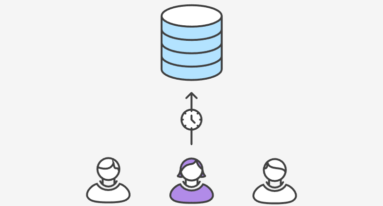
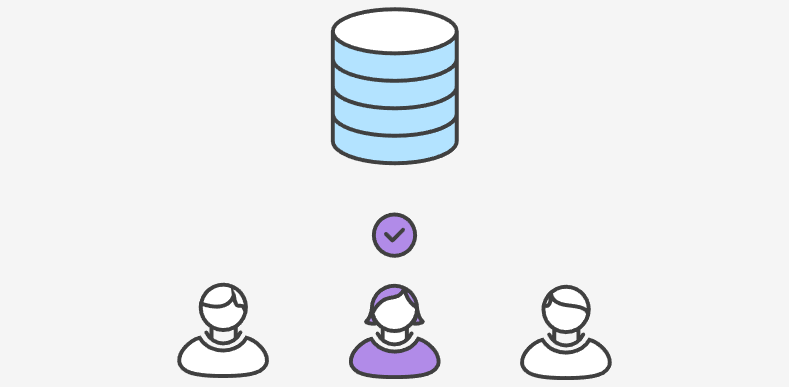
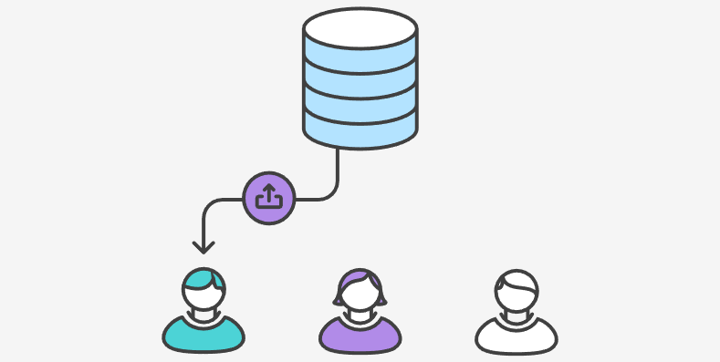
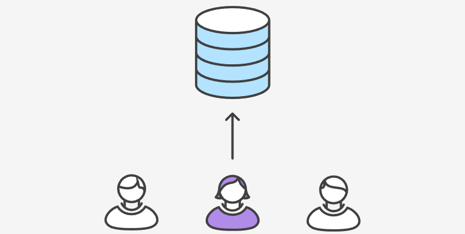

# Feature Branch Workflow

Feature Branch Workflow（特性分支工作流）是一种基于版本控制系统（如Git）的软件开发协作模式，旨在支持并行开发、代码审查和稳定的版本发布。在这种工作流中，每个新功能或修复都在其自己的分支上开发，然后通过代码审查和测试后，再合并回主分支。

## 工作方式

1. **中央仓库和主分支：** 仍然存在一个中央仓库，其中的 `master` 分支代表了正式项目的历史。这是所有开发者共同的代码库，`master` 分支的内容应该保持稳定和可部署。
2. **功能分支的创建：** 在开始新的功能开发前，开发者会创建一个新的功能分支。这个分支会有一个描述性的名称，以清楚地表达该分支的目的，比如修复某个问题、添加某个功能等。
3. **独立的修改空间：** 功能分支和 `master` 分支之间没有技术上的区别，但是它们提供了独立的修改空间。开发者可以在功能分支上进行编辑、暂存和提交修改，而不会影响主分支中的代码。
4. **功能分支的共享：** 功能分支也可以推送到中央仓库，这样其他开发者就可以查看、合并和测试这些功能分支的修改，而不会影响主分支。这种方式可以实现在不影响正式代码的情况下，进行代码的分享与合作。
5. **分支的并行存在：** 因为 `master` 分支是唯一的“特殊”分支，所以在中央仓库上同时存在多个功能分支是完全可行的。这有助于更好地管理并行开发和备份本地提交。

## Pull Requests

功能分支工作流结合了`Pull Requests`来促进代码审查和讨论。具体如下：

1. **功能开发分支：** 开发人员从 `master` 分支创建一个新的功能分支，例如 `feature/animated-menu-items`。在这个分支上开发新的功能或修复问题。
2. **Pull Request (PR) 创建：** 一旦开发人员完成了功能的开发，他们将代码推送到中央仓库中的相应功能分支，并发起一个 Pull Request 到 `master` 分支。这允许其他团队成员对代码进行审查、讨论和提供反馈。
3. **代码审查和讨论：** 其他团队成员或相关人员可以查看 `Pull Request`，进行代码审查、讨论和提出建议。这有助于捕捉潜在问题、提出改进意见，并确保代码质量。
4. **持续改进：** 开发者根据代码审查的反馈进行适当的更改和修复。这个循环可能会重复多次，以确保代码质量和最佳实践。
5. **Pull Request 接受：** 一旦代码审查满意，`Pull Request` 可以被接受。在这一步，功能分支的代码会被合并到 `master` 分支中。
6. **同步本地 `master` 分支：** 开发者本地的 `master` 分支可能需要更新，以包含刚刚合并的功能。可以使用 `git pull origin master` 来同步本地分支。
7. **推送本地更改：** 开发者将更新后的 `master` 分支推送到中央仓库，以确保其他团队成员也能获取最新的主分支代码。

这种流程可以促进团队合作、提高代码质量，并使团队成员能够更紧密地协作。同时，它也提供了一个透明的方式来跟踪每个功能的开发进度，从而使整个项目的管理更加有序。

## 示例

下面的示例演示了如何把`Pull Requests`作为`Code Review`的方式，但注意`Pull Requests`可以用于很多其它的目的。

### 小红开始开发一个新功能

在开始进行功能开发前，小红需要一个独立的分支。她可以使用以下命令来新建一个分支：

```shell
git checkout -b marys-feature
```

在这个命令中，使用了 `-b` 选项表示如果指定的分支还不存在，则新建一个名为 `marys-feature` 的分支。在这个新分支上，小红按照之前的步骤进行编辑、暂存和提交修改，根据需要提交来实现功能：

```shell
git status
git add <some-file>
git commit
```

小红可以根据需要提交多次，以逐步完成她的功能开发。这样的方式可以确保她的修改不会直接影响到主分支（通常是 `master` 分支），并且允许她独立地进行功能开发。


<a href="https://github.com/zheng-yi-yi/myNotes/Tools_and_Environment/Git/git_workflows">

</a>

<br />


### 小红要去吃个午饭

早上，小红为新功能添加了一些提交。在去吃午饭前，将功能分支推送到中央仓库是一个不错的做法，这样可以方便地备份代码，并且如果需要与其他开发人员协作，他们也可以看到小红的提交。

她使用以下命令将 `marys-feature` 分支推送到中央仓库（`origin`）：

```shell
git push -u origin marys-feature
```

在这条命令中，`-u` 选项用于设置本地分支跟踪远程对应的分支。设置好跟踪分支后，小红就可以在以后的推送中省略指定推送的分支参数。这样，她只需使用 `git push` 命令即可将修改推送到中央仓库。


<a href="https://github.com/zheng-yi-yi/myNotes/Tools_and_Environment/Git/git_workflows">

</a>

<br />

### 小红完成功能开发

午饭后，小红回来后完成了整个功能的开发。在将修改合并到 `master` 分支之前，她想发起一个 `Pull Request`，以通知团队其他成员功能已经完成。然而，在发起 Pull Request 之前，她需要确认中央仓库中已经包含了她最近的提交：

```shell
git push
```

然后，她可以使用她的 Git GUI 客户端，在客户端中发起 Pull Request，请求将 `marys-feature` 分支合并到 `master` 分支。团队的其他成员会自动收到通知。Pull Request 的一个很酷的功能是可以在相关的提交旁边显示评论，这样可以方便地对某个变更集进行提问或讨论。这样的方式帮助团队更好地协作和审查代码。


<a href="https://github.com/zheng-yi-yi/myNotes/Tools_and_Environment/Git/git_workflows">

</a>

<br />


### 小明收到 Pull Request

当小黑收到 Pull Request 后，他会查看 marys-feature 分支的修改。然后，他可以决定在将这些修改合并到正式项目之前是否需要进行一些修改。在这个过程中，小黑和小红可以通过 Pull Request 进行来回的讨论，以确保对于修改的理解和意图是一致的。这种讨论可以在 Pull Request 页面上进行，他们可以在每个提交旁边添加评论，提出问题、建议或者进行技术讨论。

这样的讨论和审查过程有助于确保代码质量、功能完整性以及团队协作的顺畅。小黑可以根据讨论的结果，对提交的修改进行适当的调整，然后将修改合并到 master 分支，以完成整个功能的集成。


<a href="https://github.com/zheng-yi-yi/myNotes/Tools_and_Environment/Git/git_workflows">

</a>

<br />


### 小红再做修改


如果小红需要再次进行修改，她可以使用与第一个迭代相同的过程：编辑、暂存、提交，然后将更新推送到中央仓库。所有这些活动都将在 Pull Request 上显示，允许小黑进行逐步的评注和审查。

如果小黑认为有必要，他还可以将 marys-feature 分支拉取到本地，进行自己的修改。这些额外的提交也会显示在 Pull Request 页面上，确保整个讨论和修改过程的透明度。这种方式允许团队成员之间的紧密协作，以确保最终的修改达到高质量并符合团队的期望。


<a href="https://github.com/zheng-yi-yi/myNotes/Tools_and_Environment/Git/git_workflows">

</a>

<br />

### 小红发布她的功能


<a href="https://github.com/zheng-yi-yi/myNotes/Tools_and_Environment/Git/git_workflows">

</a>

<br />


一旦小黑可以接受 Pull Request，就可以将功能合并到稳定项目代码中。这个操作可以由小黑或小红来执行。下面是一个可能的合并过程：

首先，执行以下命令：

```shell
git checkout master
git pull
git pull origin marys-feature
git push
```

在这个过程中，首先切换到 `master` 分支并确保它是最新的。然后，通过执行 `git pull origin marys-feature` 将 `marys-feature` 分支的修改合并到本地的 `master` 分支。最后，通过 `git push` 将更新后的 `master` 分支推送回中央仓库。

上述过程通常会生成一个合并提交。有些开发者喜欢保留这个合并提交，因为它可以作为新功能与原始代码基线的连接点。但如果你更偏爱线性的提交历史，可以在合并时使用 `rebase` 将新功能分支 `marys-feature` 的修改移动到 `master` 分支的顶部，以实现快进（fast-forward）合并。

一些 GUI 客户端可以通过点击一个“接受”按钮来自动执行上述命令，以自动化 Pull Request 的接受过程。即使不自动执行命令，至少在功能合并到 `master` 分支后，GUI 客户端可以自动关闭相应的 Pull Request。

## 总结

总之，特性分支工作流（Feature Branch Workflow）是一种在团队协作开发中广泛使用的模式，它通过创建单独的分支来管理不同的功能开发，以保持代码库的整洁和稳定。其核心思想是，每个功能开发都在独立的分支上进行，这样可以避免直接修改主分支，从而减少冲突和稳定性问题，它的优势在于有效地隔离不同功能的开发，降低了冲突的风险，同时也方便了功能测试和代码审查。通过合理的分支管理和版本控制，提高了团队的协作效率，帮助开发者更好地管理功能开发和代码质量。无论是初学者还是经验丰富的开发者，都可以从特性分支工作流中受益，将其运用于实际开发项目中。