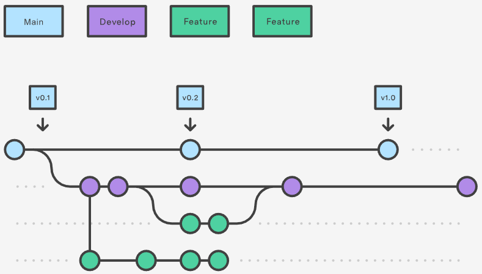

# Gitflow工作流

Gitflow工作流是一种在软件开发中使用的版本控制工作流程模型，旨在帮助团队更有效地协同开发和管理代码。它是基于Git版本控制系统的分支管理策略，并由Vincent Driessen于2010年提出。Gitflow工作流的核心思想是将开发过程分解为不同的分支，以便更好地管理特性开发、bug修复和发布等任务。

Gitflow工作流包括以下主要分支和辅助分支：

1. **主分支（Master）：** 主分支包含了稳定的、可发布的代码。通常，从主分支上的代码构建出稳定的发布版本。
2. **开发分支（Develop）：** 开发分支是团队成员协同开发的主要分支。所有特性开发、bug修复和其他开发任务都应该从开发分支进行分支，以便在开发完成后合并到主分支。
3. **特性分支（Feature）：** 每个新的特性开发都应该从开发分支中创建一个特性分支。特性分支是针对单个特性的开发工作，一旦开发完成，可以将特性分支合并回开发分支。
4. **发布分支（Release）：** 当准备发布一个新版本时，从开发分支创建一个发布分支。在发布分支上进行一些准备工作，例如版本号更新、文档整理和测试。一旦准备就绪，发布分支会被合并回主分支，并且还要将变更合并回开发分支以反映发布所做的修改。
5. **修复分支（Hotfix）：** 当生产环境中出现紧急bug时，需要从主分支创建一个修复分支。修复分支用于在主分支上进行紧急修复，修复后还需要将变更合并回开发分支和主分支。

## 工作方式

Gitflow工作流仍然基于中央仓库的概念，所有开发者在本地进行开发，然后将他们的更改推送到中央仓库以进行协同合作。

### 主要分支

Gitflow工作流通过使用两个主要分支，即`master`和`develop`，来更好地管理项目的历史和功能集成。这种分支结构有助于将不同类型的工作隔离开来，同时也提供了更好的版本控制和管理。

 

1. **`master`分支：** `master`分支是稳定的、正式发布的分支。它存储了项目的历史发布版本，每次发布一个新版本时，将相应的更改合并到`master`分支。这使得`master`分支成为一个可靠的代码基础，可以随时用于生产环境部署。
2. **`develop`分支：** `develop`分支是功能的集成分支，也可以称为开发主干。所有开发者的特性分支都合并到`develop`分支，以便在一个共同的代码库中集成各种特性和改进。这有助于确保代码的一致性和集成，同时避免了在主分支上进行实验性的开发。

### 功能分支

在Gitflow工作流中，每个新功能都位于自己的特性分支，并且这些特性分支是从`develop`分支而不是`master`分支上拉出来的。这种方式确保了`develop`分支作为功能的集成分支，同时`master`分支保持稳定和只包含已发布的代码。

 

功能分支的使用步骤大致为：

1. **创建特性分支：** 每当要开发一个新的功能，开发者从`develop`分支创建一个新的特性分支，例如`feature/new-feature`。在这个特性分支上进行功能开发工作。
2. **本地提交：** 开发者在特性分支上进行代码修改，然后将这些修改提交到本地仓库。
3. **推送到中央仓库：** 开发者可以将特性分支推送到中央仓库，以便备份和协作。这让其他团队成员能够查看和合并特性分支上的更改。
4. **完成特性开发：** 一旦特性开发完成，开发者可以将特性分支合并回`develop`分支。
5. **合并请求：** 在合并特性分支回`develop`分支之前，可以创建一个合并请求（Pull Request）以便其他团队成员进行代码审查。
6. **合并到`develop`分支：** 经过审查后，特性分支将被合并回`develop`分支。这将把新功能集成到主要开发线中。

通过这种方法，`develop`分支充当了功能集成的主干，所有新功能都经过严格的测试和审查，确保它们能够良好地与其他功能协同工作。而`master`分支则仅包含已经经过稳定性验证的版本，用于生产环境部署。

### 发布分支

 

主要步骤：

1. **创建发布分支：** 当开发进展到一定程度，或者接近预定的发布日期时，从`develop`分支上创建一个新的发布分支，例如`release/1.0.0`。
2. **发布准备工作：** 在发布分支上进行一些准备工作，例如版本号更新、文档生成、Bug修复等。这个分支专注于准备发布所需的任务。
3. **Bug修复和文档生成：** 在发布分支上，可以进行与发布相关的Bug修复、文档生成等任务，以确保发布版本的质量。
4. **合并回`develop`分支：** 在发布分支上进行的修改需要合并回`develop`分支，以确保将这些变更纳入下一个开发周期。
5. **合并回`master`分支：** 一旦发布分支准备好，并且发布的工作都已完成，将发布分支合并回`master`分支，以及为发布版本打上一个版本号的标签（Tag）。
6. **继续开发：** 合并回`master`分支后，可以继续在`develop`分支上开发新的功能，开始新的开发周期。

通过这种发布准备分支的方式，团队可以同时处理准备发布的任务和继续开发新功能，使得开发和发布之间的过渡更加平稳。这种方法也使得团队可以在不影响生产环境的情况下进行测试和准备，同时保持了代码的稳定性和版本控制。

### 维护分支

 

维护分支（或热修复分支）是用于紧急修复生产环境中出现的bug，从`master`分支直接创建，然后修复完成后合并回`master`分支和`develop`分支，以确保修复同步到当前的发布分支。主要步骤如下：

1. **创建维护分支：** 当在生产环境中出现紧急的bug需要修复时，从`master`分支创建一个新的维护分支，例如`hotfix/bug-fix`.
2. **进行修复工作：** 在维护分支上进行必要的修复工作，解决生产环境中的问题。
3. **合并回`master`分支：** 修复完成后，将维护分支合并回`master`分支，以确保生产环境中的问题得到解决。
4. **合并回`develop`分支：** 为了确保修复在下一个版本中也得到修复，将维护分支的修改合并回`develop`分支。
5. **打上Tag：** 在`master`分支上打上一个新的版本号的标签，以标识这个修复版本。

维护分支的使用允许团队在不影响当前开发周期的情况下，快速响应和解决生产环境中的问题。这种方式确保了高效的bug修复和发布过程，同时不干扰正在进行的开发工作。这在保持生产环境稳定和可靠的同时，也使得团队能够及时应对紧急情况。

## 示例

**Feature Branch Flow 示例：**

1. `git checkout main`：切换到主分支（`main`或`master`分支）。
2. `git checkout -b develop`：基于主分支创建一个名为`develop`的新分支。这是用于功能集成的主要分支。
3. `git checkout -b feature_branch`：从`develop`分支创建一个新的特性分支，名为`feature_branch`。在这个分支上进行特性开发。
4. 在`feature_branch`上进行工作：在特性分支上进行代码修改和开发工作。
5. `git checkout develop`：切换回`develop`分支。
6. `git merge feature_branch`：将`feature_branch`分支上的工作合并回`develop`分支，以将特性集成到主要开发线。
7. `git checkout main`：切换回主分支。
8. `git merge develop`：将`develop`分支的变更合并回主分支，以便将所有的特性集成到主分支。
9. `git branch -d feature_branch`：在完成特性分支的工作后，删除特性分支，因为它已经不再需要。

**Hotfix Flow 示例：**

1. `git checkout main`：切换到主分支。
2. `git checkout -b hotfix_branch`：从主分支创建一个新的分支，名为`hotfix_branch`。在这个分支上进行紧急修复工作。
3. 在`hotfix_branch`上进行工作：在热修复分支上进行代码修改和修复工作。
4. `git checkout develop`：切换到`develop`分支。
5. `git merge hotfix_branch`：将`hotfix_branch`分支上的修复合并回`develop`分支，以确保修复同步到下一个开发周期。
6. `git checkout main`：切换回主分支。
7. `git merge hotfix_branch`：将`hotfix_branch`分支上的修复合并回主分支，以将修复引入到生产环境。

---

[« 功能分支工作流](workflow_feature_branch.md)　　　　[Forking 工作流 »](workflow_forking.md)